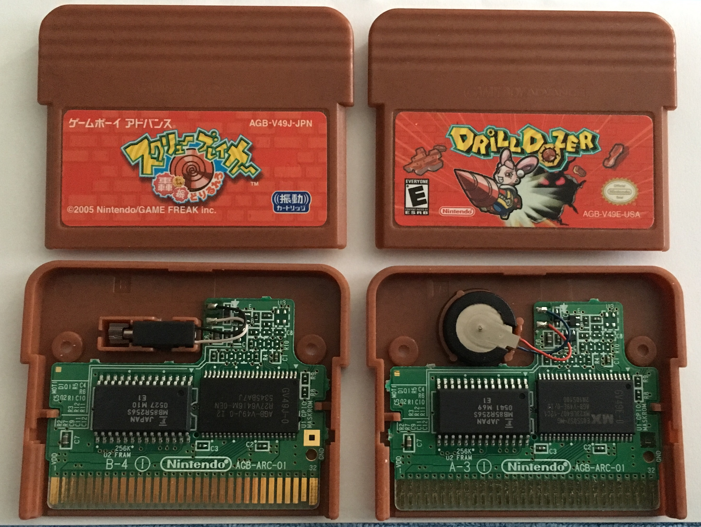

# Rumble in the US and Japanese versions of Drill Dozer

I somehow ended up with a Japanese and a US version of Drill Dozer
and was wondering which one I should keep to myself. I got the
Japanese version first, so I felt that the US one didn't “drill”
as much.

## Hardware differences

The hardware looks slightly different. The US version might have
slightly weaker rumble motors, and they're also in a different
places inside the cart shell itself.



## Software differences

I dumped the 2 versions of the game using my Retrode.
Don't forget to set the voltage switch to 3.3V.

```sh
$ md5sum DrillDozer.V49E.gba Screwbreaker.V49J.gba
14dab12e795098988d46b96885170538  DrillDozer.V49E.gba
1455d99497a4d004aa0edc0e50bd2530  Screwbreaker.V49J.gba
```

After that I created a [patch for mGBA](data/0001-gba-Print-some-Rumble-debug.patch)
which would dump some information to the stdout in CSV format. I could
probably have done that with the debugger, but it was easier to just
modify the sources).

The output after about a minute of a newly booted game is available in
the [data folder](data/)

The Japanese version will rumble during boot which the US one doesn't which
is fairly obvious during use. In our capture, we have 3 other instances
of the rumble motor being toggled on/off for a period of time. Let's compare
those. The time unit is "cycles" as reported by mGBA.

| Screw Breaker (J)  | Drill Dozer (U) |
| ------------------ | --------------- |
| 34 rumbles, 20447235 cycles | 34 rumbles, 20447228 cycles |
| 100 rumbles, 55754765 cycles | 100 rumbles, 55754761 cycles |
| 43 rumbles, 25001990 cycles | 43 rumbles, 25001989 cycles |

Given the results (no, I didn't care to figure out whether I got
possible off-by-ones errors in the ranges calculations correctly,
the point is moot).

## Conclusion

The data is pretty clear, the game rumbles in the same way for both
games in key places, although it rumbles less often in the US if
the intro is anything to go by.

The main difference is thus the hardware, and a question of
taste. Enjoy the drilling!
